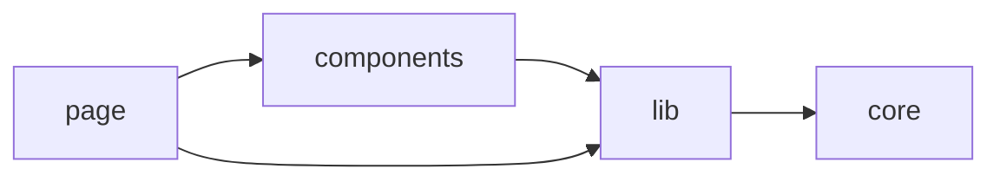

# Turborepo starter with Next.js 13 + Axios + React-Query + Zod + Prisma

## What's inside?

This templates includes the following modules/packages:

- [pnpm](https://pnpm.io) as a package manager
- [axios](https://axios-http.com) as HTTP client
- [prisma](https://www.prisma.io) as an ORM for working with DB
- [react-query](https://tanstack.com/query/v4) for managing cache and backend state on the client
- [authentication](https://jwt.io/introduction) with JWT token and refresh logic (protected against XSS and CSRF attacks)
- [middleware](https://nextjs.org/docs/advanced-features/middleware) for checking auth properties(access token in headers, refresh token and fingerprint in cookies)
- TODO: add modules/packages
- TODO: maybe separate `authentication` and `middleware` to independent paragraph

### Project Apps and Packages

- `web`: another [Next.js](https://beta.nextjs.org/docs)) app
- `ui`: a stub React component library shared by both `web` and `docs` applications
- `eslint-config-custom`: `eslint` configurations (includes `eslint-config-next` and `eslint-config-prettier`)
- `tsconfig`: `tsconfig.json`s used throughout the monorepo

Each package/app is 100% [TypeScript](https://www.typescriptlang.org/).

### Dependencies flow rule for `web' app



> TODO: write an alert "about wrong direction"

### Maintainable app structure

```
web
|
└───prisma
│   │   schema.prisma
│   │   ...
└───src
│   │
│   └───app
│   │    │
│   │    └───(private) // routes require auth
│   │    │    │
│   │    │    └───posts
│   │    │    │    |    layout.tsx // this layout uses CSR for supporting 'react-query'
│   │    │    │    |    ....
│   │    │    │
│   │    │    └───profile
│   │    │    │    |    ...
│   │    │    │
│   │    │    │    layout.tsx // check access token in localStorage
│   │    │    │    ...
│   │    │
│   │    └───login
│   │    │    |    ...
│   │    │
│   │    │    layout.tsx // root layout
│   │
│   └───components
│   │    │
│   │    └───auth
│   │    │    │   component.tsx
│   │    │    │   ...
│   │    │
│   │    └───posts
│   │        │   component.tsx
│   │        │   ...
│   │
│   └───core // some basic reusable logic
│   │    │
│   │    └───components
│   │    │
│   │    └───config
│   │    │
│   │    └───hooks
│   │    │
│   │    └───utils
│   │    │
│   │    └───styles
│   │    │
│   │    │    types.ts
│   │
│   └───fixtures
│   │    │
│   │    │    posts.json
│   │
│   └───lib
│   │    │
│   │    └───auth
│   │    │    │
│   │    │    └───api
│   │    │    │    |    ....
│   │    │    │
│   │    │    └───hooks
│   │    │    │    |    ....
│   │    │    │
│   │    │    └───models
│   │    │    │    |    ....
│   │    │    │
│   │    │    └───utils
│   │    │    │    |    ....
│   │    │    │
│   │    │    │    ....
│   │    │
│   │    └───posts
│   │    │    |    ...
│   │    │
│   │    └───users
│   │         |    ...
│   │
│   └───pages/api
│   │    │
│   │    └───auth
│   │
│   │   middleware.ts
│
│   ...
```

### Utilities

This turborepo has some additional tools already setup for you:

- [TypeScript](https://www.typescriptlang.org/) for static type checking
- [ESLint](https://eslint.org/) for code linting
- [Prettier](https://prettier.io) for code formatting

### Project env variables

```bash
NEXT_PUBLIC_HOST=localhost
NEXT_PUBLIC_PORT=3000

JWT_SECRET=random chars
DATABASE_URL=url to your db(local or remote)
```

### [Prisma setup](https://www.prisma.io/docs/reference/api-reference/command-reference)

```bash
  # Setup a new Prisma project
  prisma init

  # Generate artifacts (e.g. Prisma Client)
  prisma generate

  # Browse your data
  prisma studio

  # Create migrations from your Prisma schema, apply them to the database, generate artifacts (e.g. Prisma Client)
  prisma migrate dev

  # Pull the schema from an existing database, updating the Prisma schema
  prisma db pull

  # Push the Prisma schema state to the database
  prisma db push
```

### Develop

To develop all apps and packages, run the following command:

```bash
cd project-name
pnpm run dev
```

### Build

To build all apps and packages, run the following command:

```bash
cd project-name
pnpm run build
```

### Remote Caching

Turborepo can use a technique known as [Remote Caching](https://turborepo.org/docs/core-concepts/remote-caching) to share cache artifacts across machines, enabling you to share build caches with your team and CI/CD pipelines.

By default, Turborepo will cache locally. To enable Remote Caching you will need an account with Vercel. If you don't have an account you can [create one](https://vercel.com/signup), then enter the following commands:

```bash
cd project-name
pnpm dlx turbo login
```

This will authenticate the Turborepo CLI with your [Vercel account](https://vercel.com/docs/concepts/personal-accounts/overview).

Next, you can link your Turborepo to your Remote Cache by running the following command from the root of your turborepo:

```bash
pnpm dlx turbo link
```

## Useful Links

Main project packages:

- TODO: add packages

Learn more about the power of Turborepo:

- [Pipelines](https://turborepo.org/docs/core-concepts/pipelines)
- [Caching](https://turborepo.org/docs/core-concepts/caching)
- [Remote Caching](https://turborepo.org/docs/core-concepts/remote-caching)
- [Scoped Tasks](https://turborepo.org/docs/core-concepts/scopes)
- [Configuration Options](https://turborepo.org/docs/reference/configuration)
- [CLI Usage](https://turborepo.org/docs/reference/command-line-reference)
